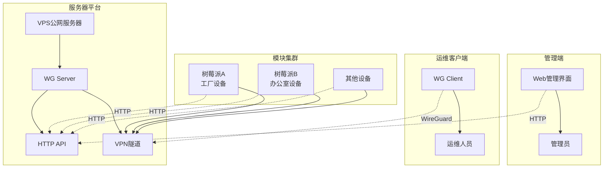

# 🚀 EiTec VPN - WireGuard 集中管理平台

[](https://golang.org)
[](LICENSE)
[](https://www.wireguard.com)

基于 **Go + Gin** 的现代化 WireGuard 集中管理解决方案，支持多设备统一管控和远程运维。

> **v2.1 重大更新**: 采用Laravel风格的模型架构，实现了服务器端和模块端的完全分离，提升了代码的可维护性和扩展性。

## 🏗️ 系统架构



## 🚀 快速开始

### 环境要求
- Go 1.21+
- WireGuard 工具
- Linux 系统 (推荐 Ubuntu/Debian)

### 部署

```bash
# 克隆项目
git clone https://github.com/your-org/eitec-vpn.git
cd eitec-vpn

# 构建
make build

# 启动服务器端
sudo ./bin/eitec-vpn-server --config configs/server.yaml

# 启动模块端
sudo ./bin/eitec-vpn-module --config configs/module.yaml
```

## 🏛️ 架构设计

### 分层架构

```
┌─────────────────────────────────────────────────────────────┐
│                     架构分层图                                │
├─────────────────────────────────────────────────────────────┤
│                                                             │
│  ┌─────────────────┐    ┌─────────────────┐                │
│  │   服务器端       │    │   模块端        │                │
│  │  (数据库驱动)    │    │  (文件驱动)     │                │
│  └─────────────────┘    └─────────────────┘                │
│         │                        │                         │
│  ┌─────────────────┐    ┌─────────────────┐                │
│  │ server/models   │    │ module/models   │                │
│  │ server/database │    │ (本地存储)      │                │
│  │ server/handlers │    │ module/handlers │                │
│  │ server/services │    │ module/services │                │
│  └─────────────────┘    └─────────────────┘                │
│         │                        │                         │
│  ┌─────────────────────────────────────────────────────────┐ │
│  │                shared/ (共享组件)                        │ │
│  │  ┌─────────┐ ┌─────────┐ ┌─────────┐ ┌─────────┐       │ │
│  │  │  auth   │ │response │ │ config  │ │  utils  │       │ │
│  │  └─────────┘ └─────────┘ └─────────┘ └─────────┘       │ │
│  └─────────────────────────────────────────────────────────┘ │
└─────────────────────────────────────────────────────────────┘
```

### 设计原则
- **单一职责**: 每个模型文件专注于一个业务实体
- **清晰命名**: 文件名直接反映模型用途和功能
- **依赖注入**: 通过接口实现松耦合设计
- **数据一致性**: 统一的数据验证和错误处理机制

## 📁 项目结构

```
eitec-vpn/
├── cmd/                          # 应用入口点
│   ├── server/                   # 服务器端主程序
│   └── module/                   # 模块端主程序
├── internal/                     # 内部包
│   ├── server/                   # 服务器端业务逻辑
│   │   ├── models/              # 服务器端数据模型
│   │   ├── database/            # 数据库连接和管理
│   │   ├── handlers/            # HTTP 处理器
│   │   ├── middleware/          # 中间件
│   │   ├── services/            # 业务服务
│   │   ├── routes/              # 路由定义
│   │   └── cron/                # 定时任务
│   ├── module/                   # 模块端业务逻辑
│   │   ├── models/              # 模块端本地模型
│   │   ├── handlers/            # 模块端处理器
│   │   ├── services/            # 模块端服务
│   │   └── routes/              # 模块端路由
│   └── shared/                   # 共享组件
│       ├── auth/                # 认证服务
│       ├── response/            # 统一响应处理
│       ├── config/              # 配置管理
│       ├── wireguard/           # WireGuard 工具
│       └── utils/               # 工具函数
├── web/                          # 前端资源
├── configs/                      # 配置文件
├── scripts/                      # 部署脚本
└── docs/                         # 文档
```

## 🛠️ 技术栈

### 核心技术

| 技术 | 版本 | 用途 |
|------|------|------|
| **Go** | 1.23+ | 后端服务开发 |
| **Gin** | 1.10+ | Web框架 |
| **GORM** | 1.30+ | ORM框架 |
| **SQLite** | 3.x | 数据存储 |
| **JWT** | v5 | 身份认证 |
| **WireGuard** | 最新版 | VPN协议 |

### 主要依赖

```go
require (
    github.com/gin-gonic/gin v1.10.1        // Web框架
    github.com/golang-jwt/jwt/v5 v5.2.2     // JWT认证
    github.com/shirou/gopsutil/v3 v3.24.5   // 系统监控
    golang.org/x/crypto v0.39.0             // 加密算法
    gopkg.in/yaml.v3 v3.0.1                 // YAML解析
    gorm.io/driver/sqlite v1.6.0            // SQLite驱动
    gorm.io/gorm v1.30.0                    // ORM框架
)
```

## ⚙️ 配置说明

### 服务器配置 (configs/server.yaml)

```yaml
app:
  name: "EiTec VPN Server"
  port: 8080
  mode: "release"                    # debug, release, test
  secret: "your-jwt-secret-key"      # JWT密钥
  log_level: "info"                  # 日志级别
  
wireguard:
  interface: "wg0"                   # WireGuard接口名
  port: 51820                        # WireGuard端口
  network: "10.10.0.0/24"           # 内网地址段
  dns: "8.8.8.8,8.8.4.4"            # DNS服务器
  mtu: 1420                          # MTU值
  
database:
  type: "sqlite"                     # 数据库类型
  path: "data/eitec-vpn.db"          # 数据库路径
  log_level: "warn"                  # 数据库日志级别
  
auth:
  admin_username: "admin"            # 管理员用户名
  admin_password: "admin123"         # 管理员密码
  session_timeout: 24h               # 会话超时时间
  jwt_expiry: 24h                    # JWT过期时间
  
monitoring:
  metrics_enabled: true              # 启用指标收集
  health_check_interval: 30s         # 健康检查间隔
  traffic_stats_interval: 60s        # 流量统计间隔
```

### 模块配置 (configs/module.yaml)

```yaml
app:
  name: "EiTec VPN Module"
  port: 8080
  secret: "your-jwt-secret-key"
  log_level: "info"
  
module:
  name: "默认模块"                    # 模块名称
  location: "未设置"                  # 地理位置
  description: "模块描述"             # 模块描述
  
wireguard:
  interface: "wg0"                   # WireGuard接口名
  config_path: "/etc/wireguard"      # 配置文件路径
  
server:
  url: "http://your-server:8080"     # 服务器地址
  api_key: "your-api-key"            # API密钥
  heartbeat_interval: 30s            # 心跳间隔
  
logging:
  level: "info"                      # 日志级别
  file: "logs/module.log"            # 日志文件
  max_size: 100MB                    # 最大日志大小
  max_age: 7d                        # 日志保留天数
```

## 🔗 API 接口

### 服务器端 API

#### 认证相关

| 接口 | 方法 | 描述 | 权限 |
|------|------|------|------|
| `/api/auth/login` | POST | 管理员登录 | 公开 |
| `/api/auth/logout` | POST | 退出登录 | 需要认证 |
| `/api/auth/profile` | GET | 获取用户信息 | 需要认证 |
| `/api/auth/refresh` | POST | 刷新Token | 需要认证 |

#### 模块管理

| 接口 | 方法 | 描述 | 权限 |
|------|------|------|------|
| `/api/modules` | GET | 获取模块列表 | 需要认证 |
| `/api/modules` | POST | 创建新模块 | 需要认证 |
| `/api/modules/:id` | GET | 获取模块详情 | 需要认证 |
| `/api/modules/:id` | PUT | 更新模块信息 | 需要认证 |
| `/api/modules/:id` | DELETE | 删除模块 | 需要认证 |
| `/api/modules/:id/config` | GET | 获取模块配置 | 需要认证 |
| `/api/modules/:id/status` | GET | 获取模块状态 | 需要认证 |
| `/api/modules/:id/restart` | POST | 重启模块 | 需要认证 |

#### 系统监控

| 接口 | 方法 | 描述 | 权限 |
|------|------|------|------|
| `/api/dashboard` | GET | 获取仪表盘数据 | 需要认证 |
| `/api/system/status` | GET | 获取系统状态 | 需要认证 |
| `/api/system/metrics` | GET | 获取系统指标 | 需要认证 |
| `/api/traffic/stats` | GET | 获取流量统计 | 需要认证 |

### 模块端 API

| 接口 | 方法 | 描述 |
|------|------|------|
| `/api/config/apply` | POST | 应用配置 |
| `/api/config/current` | GET | 获取当前配置 |
| `/api/status` | GET | 获取运行状态 |
| `/api/health` | GET | 健康检查 |
| `/api/logs` | GET | 获取日志 |

### API 响应格式

```json
{
  "success": true,
  "code": 200,
  "message": "操作成功",
  "data": {
    // 具体数据
  },
  "timestamp": "2024-01-01T00:00:00Z"
}
```

## 🔒 安全特性

- **JWT 认证**: 安全的会话管理和Token轮换
- **密钥管理**: 自动密钥生成、轮换和验证
- **访问控制**: 基于角色的权限管理(RBAC)
- **审计日志**: 完整的操作日志记录和追踪
- **数据加密**: 敏感数据加密存储和传输

## 👨‍💻 开发指南

### 项目构建

```bash
# 安装依赖
make deps

# 构建所有组件
make build

# 分别构建
make build-server      # 构建服务器端
make build-module      # 构建模块端
make build-arm64       # 构建ARM64版本 (树莓派)

# 开发模式运行
make run-server        # 开发模式运行服务器
make run-module        # 开发模式运行模块

# 代码质量检查
make test              # 运行测试
make lint              # 代码检查
make fmt               # 格式化代码
```

### 代码结构规范

```bash
# 添加新的服务器端模型
internal/server/models/your_model.go

# 添加新的模块端配置
internal/module/models/your_config.go

# 添加共享工具函数
internal/shared/utils/your_utils.go

# 添加API处理器
internal/server/handlers/your_handler.go

# 添加业务服务
internal/server/services/your_service.go
```

### 数据库迁移

```bash
# 创建迁移
# 在 internal/server/models/migrate.go 中添加新模型

# 强制重新初始化数据库
./bin/eitec-vpn-server --init

# 查看数据库状态
sqlite3 data/eitec-vpn.db ".tables"

# 备份数据库
cp data/eitec-vpn.db data/eitec-vpn.db.backup
```

### API开发

```go
// 使用统一响应格式
import "eitec-vpn/internal/shared/response"

func YourHandler(c *gin.Context) {
    // 参数验证
    var req YourRequest
    if err := c.ShouldBindJSON(&req); err != nil {
        response.BadRequest(c, "参数错误: "+err.Error())
        return
    }
    
    // 业务逻辑处理
    data, err := yourService.Process(req)
    if err != nil {
        response.InternalError(c, "处理失败: "+err.Error())
        return
    }
    
    // 成功响应
    response.Success(c, data)
}
```

### 测试指南

```bash
# 运行所有测试
make test

# 运行特定包的测试
go test -v ./internal/server/...

# 运行测试并生成覆盖率报告
go test -v -coverprofile=coverage.out ./...
go tool cover -html=coverage.out

# 运行基准测试
go test -bench=. ./internal/server/...
```

## 🐛 故障排除

### 常见问题

#### 1. 服务器启动失败

```bash
# 检查端口占用
sudo netstat -tlnp | grep :8080

# 检查配置文件
./bin/eitec-vpn-server --config configs/server.yaml --validate

# 查看详细日志
./bin/eitec-vpn-server --config configs/server.yaml --debug
```

#### 2. WireGuard连接失败

```bash
# 检查WireGuard状态
sudo wg show

# 检查接口状态
sudo ip link show wg0

# 检查路由表
sudo ip route show

# 重启WireGuard服务
sudo systemctl restart wg-quick@wg0
```

#### 3. 数据库连接错误

```bash
# 检查数据库文件权限
ls -la data/eitec-vpn.db

# 修复数据库权限
sudo chown $USER:$USER data/eitec-vpn.db
chmod 644 data/eitec-vpn.db

# 重新初始化数据库
./bin/eitec-vpn-server --init
```

### 性能调优

#### 系统参数优化

```bash
# 增加文件描述符限制
echo "* soft nofile 65536" | sudo tee -a /etc/security/limits.conf
echo "* hard nofile 65536" | sudo tee -a /etc/security/limits.conf

# 优化网络参数
echo "net.core.somaxconn = 65535" | sudo tee -a /etc/sysctl.conf
echo "net.ipv4.tcp_max_syn_backlog = 65535" | sudo tee -a /etc/sysctl.conf
sudo sysctl -p
```

#### 应用配置优化

```yaml
# configs/server.yaml
app:
  mode: "release"                    # 生产模式
  log_level: "warn"                  # 减少日志输出
  
database:
  log_level: "error"                 # 减少数据库日志
  max_open_conns: 100               # 连接池大小
  max_idle_conns: 10                # 空闲连接数
  
monitoring:
  metrics_enabled: false             # 生产环境关闭指标收集
  health_check_interval: 60s         # 增加健康检查间隔
```

### 日志分析

```bash
# 查看实时日志
tail -f logs/server.log

# 搜索错误日志
grep "ERROR" logs/server.log

# 分析日志统计
grep "ERROR" logs/server.log | wc -l

# 查看特定时间段的日志
grep "2024-01-01" logs/server.log
```

## 📄 许可证

MIT License - 详见 [LICENSE](LICENSE) 文件 