# 🚀 EiTec VPN - WireGuard 集中管理平台

[](https://golang.org)
[](LICENSE)
[](https://github.com/your-org/eitec-vpn)
[](https://www.wireguard.com)

> **v2.1 重大更新**: 采用Laravel风格的模型架构，实现了服务器端和模块端的完全分离，提升了代码的可维护性和扩展性。

基于 **Go + Gin** 的现代化 WireGuard 集中管理解决方案，支持多设备统一管控和远程运维。专为企业级VPN管理而设计，提供直观的Web界面和强大的API接口。

## 📋 目录

- [✨ 核心特性](#-核心特性)
- [🏗️ 系统架构](#️-系统架构)
- [🚀 快速开始](#-快速开始)
- [🏛️ 架构设计](#️-架构设计)
- [📁 项目结构](#-项目结构)
- [🛠️ 技术栈](#️-技术栈)
- [⚙️ 配置说明](#️-配置说明)
- [🔗 API 接口](#-api-接口)
- [🎨 用户界面](#-用户界面)
- [📊 监控与状态](#-监控与状态)
- [🔒 安全特性](#-安全特性)
- [👨‍💻 开发指南](#️-开发指南)
- [🐛 故障排除](#-故障排除)
- [🤝 贡献指南](#-贡献指南)
- [📄 许可证](#-许可证)

## ✨ 核心特性

### 🎛️ 服务器管理平台
- **📊 统一仪表盘**: 实时监控所有接入设备状态和网络流量
- **🔧 设备管理**: 可视化设备列表，支持搜索、筛选和批量操作
- **⚡ 配置自动化**: 一键生成设备和运维配置，支持模板化配置
- **🔐 访问控制**: 基于JWT的权限管理和多用户认证系统
- **📈 状态监控**: 实时连接状态、流量统计和性能指标
- **🌍 地理分布**: 设备地理位置分布和网络拓扑可视化

### 📱 模块端应用  
- **🔑 简化配置**: 一键导入服务器生成的配置，支持二维码扫描
- **📊 状态显示**: 清晰的连接状态、网络信息和性能指标
- **⚙️ 本地管理**: 基础的设备信息、网络配置和日志查看
- **💡 轻量设计**: 专为树莓派等低功耗设备优化，资源占用极低
- **🔄 自动重连**: 智能重连机制，确保网络稳定性

## 🏗️ 系统架构

```mermaid
graph TB
    subgraph "管理端"
        A[Web管理界面] --> B[管理员]
    end
    
    subgraph "服务器平台"
        C[VPS公网服务器] --> D[WG Server]
        D --> E[HTTP API]
        D --> F[VPN隧道]
    end
    
    subgraph "运维客户端"
        G[WG Client] --> H[运维人员]
    end
    
    subgraph "模块集群"
        I[树莓派A<br/>工厂设备] --> F
        J[树莓派B<br/>办公室设备] --> F
        K[其他设备] --> F
    end
    
    A -.->|HTTP| E
    G -.->|WireGuard| F
    I -.->|HTTP| E
    J -.->|HTTP| E
    K -.->|HTTP| E
```



## 🚀 快速开始

### 📋 环境要求

| 组件 | 最低版本 | 推荐版本 |
|------|----------|----------|
| **Go** | 1.21+ | 1.23+ |
| **WireGuard** | 最新版 | 最新版 |
| **操作系统** | Linux | Ubuntu 22.04+ / Debian 12+ |
| **内存** | 512MB | 2GB+ |
| **存储** | 1GB | 10GB+ |

### 🚀 一键部署

#### 1. 服务器端部署

```bash
# 克隆项目
git clone https://github.com/your-org/eitec-vpn.git
cd eitec-vpn

# 一键构建和部署
make all
make install-wireguard
make generate-keys

# 启动服务
sudo ./bin/eitec-vpn-server --config configs/server.yaml
```

#### 2. 模块端部署

```bash
# 在树莓派上构建ARM64版本
make build-arm64

# 配置并启动
sudo ./bin/eitec-vpn-module-arm64 --config configs/module.yaml
```

### 🐳 Docker 部署

```bash
# 构建镜像
make docker-build

# 运行服务器端
docker run -d \
  --name eitec-vpn-server \
  --network host \
  -v $(pwd)/configs:/app/configs \
  -v $(pwd)/data:/app/data \
  eitec-vpn-server

# 运行模块端
docker run -d \
  --name eitec-vpn-module \
  --network host \
  --privileged \
  -v $(pwd)/configs:/app/configs \
  eitec-vpn-module
```

## 🏛️ 架构设计

### 🏗️ 分层架构

项目采用清晰的分层架构设计，实现了服务器端和模块端的完全分离：

```
┌─────────────────────────────────────────────────────────────┐
│                     架构分层图                                │
├─────────────────────────────────────────────────────────────┤
│                                                             │
│  ┌─────────────────┐    ┌─────────────────┐                │
│  │   服务器端       │    │   模块端        │                │
│  │  (数据库驱动)    │    │  (文件驱动)     │                │
│  └─────────────────┘    └─────────────────┘                │
│         │                        │                         │
│  ┌─────────────────┐    ┌─────────────────┐                │
│  │ server/models   │    │ module/models   │                │
│  │ server/database │    │ (本地存储)      │                │
│  │ server/handlers │    │ module/handlers │                │
│  │ server/services │    │ module/services │                │
│  └─────────────────┘    └─────────────────┘                │
│         │                        │                         │
│  ┌─────────────────────────────────────────────────────────┐ │
│  │                shared/ (共享组件)                        │ │
│  │  ┌─────────┐ ┌─────────┐ ┌─────────┐ ┌─────────┐       │ │
│  │  │  auth   │ │response │ │ config  │ │  utils  │       │ │
│  │  └─────────┘ └─────────┘ └─────────┘ └─────────┘       │ │
│  └─────────────────────────────────────────────────────────┘ │
└─────────────────────────────────────────────────────────────┘
```

### 🎯 设计原则

- **🔒 单一职责**: 每个模型文件专注于一个业务实体
- **📝 清晰命名**: 文件名直接反映模型用途和功能
- **🔄 依赖注入**: 通过接口实现松耦合设计
- **📊 数据一致性**: 统一的数据验证和错误处理机制
- **🚀 性能优化**: 连接池、缓存和异步处理

## 📁 项目结构

```
eitec-vpn/
├── 📁 cmd/                          # 应用入口点
│   ├── 🖥️ server/                   # 服务器端主程序
│   │   └── main.go
│   └── 📱 module/                   # 模块端主程序
│       └── main.go
├── 📁 internal/                     # 内部包
│   ├── 🖥️ server/                   # 服务器端业务逻辑
│   │   ├── 📊 models/              # 服务器端数据模型 (Laravel风格)
│   │   │   ├── module.go           # 模块信息模型
│   │   │   ├── user.go             # 用户管理模型
│   │   │   ├── system_config.go    # 系统配置模型
│   │   │   ├── dashboard_stats.go  # 仪表盘统计模型
│   │   │   ├── traffic_stats.go    # 流量统计模型
│   │   │   └── ...                 # 其他模型文件
│   │   ├── 🗄️ database/            # 数据库连接和管理
│   │   │   └── database.go
│   │   ├── 🎮 handlers/            # HTTP 处理器
│   │   ├── 🔒 middleware/          # 中间件
│   │   ├── ⚙️ services/            # 业务服务
│   │   ├── 🛣️ routes/              # 路由定义
│   │   └── ⏰ cron/                # 定时任务
│   ├── 📱 module/                   # 模块端业务逻辑
│   │   ├── 📊 models/              # 模块端本地模型
│   │   │   ├── local_module.go     # 本地模块配置
│   │   │   ├── local_log.go        # 本地日志记录
│   │   │   └── ...                 # 其他本地模型
│   │   ├── 🎮 handlers/            # 模块端处理器
│   │   ├── ⚙️ services/            # 模块端服务
│   │   └── 🛣️ routes/              # 模块端路由
│   └── 🔗 shared/                   # 真正共享的组件
│       ├── 🔐 auth/                # 认证服务
│       ├── 📤 response/            # 统一响应处理
│       ├── ⚙️ config/              # 配置管理
│       ├── 🌐 wireguard/           # WireGuard 工具
│       └── 🛠️ utils/               # 工具函数
├── 🌐 web/                          # 前端资源
│   ├── 🖥️ server/                   # 服务器端前端
│   │   ├── 📄 templates/           # HTML 模板
│   │   ├── 🎨 static/              # 静态资源
│   │   └── 📦 assets/              # 编译后资源
│   └── 📱 module/                   # 模块端前端
│       ├── 📄 templates/
│       └── 🎨 static/
├── ⚙️ configs/                      # 配置文件
│   ├── server.yaml                 # 服务器配置
│   └── module.yaml                 # 模块配置
├── 📜 scripts/                      # 部署脚本
│   ├── install-server.sh
│   ├── install-module.sh
│   └── docker/
├── 📚 docs/                         # 文档
├── 🗄️ data/                         # 数据文件
├── 📝 logs/                         # 日志文件
├── 🏗️ Makefile                      # 构建脚本
└── 📄 README.md                     # 项目说明
```

## 🛠️ 技术栈

### 🎯 核心技术

| 技术 | 版本 | 用途 |
|------|------|------|
| **Go** | 1.23+ | 后端服务开发 |
| **Gin** | 1.10+ | Web框架 |
| **GORM** | 1.30+ | ORM框架 |
| **SQLite** | 3.x | 数据存储 |
| **JWT** | v5 | 身份认证 |
| **WireGuard** | 最新版 | VPN协议 |

### 📚 主要依赖

```go
require (
    github.com/gin-gonic/gin v1.10.1        // Web框架
    github.com/golang-jwt/jwt/v5 v5.2.2     // JWT认证
    github.com/shirou/gopsutil/v3 v3.24.5   // 系统监控
    golang.org/x/crypto v0.39.0             // 加密算法
    gopkg.in/yaml.v3 v3.0.1                 // YAML解析
    gorm.io/driver/sqlite v1.6.0            // SQLite驱动
    gorm.io/gorm v1.30.0                    // ORM框架
)
```

## ⚙️ 配置说明

### 🖥️ 服务器配置 (configs/server.yaml)

```yaml
app:
  name: "EiTec VPN Server"
  port: 8080
  mode: "release"                    # debug, release, test
  secret: "your-jwt-secret-key"      # JWT密钥
  log_level: "info"                  # 日志级别
  
wireguard:
  interface: "wg0"                   # WireGuard接口名
  port: 51820                        # WireGuard端口
  network: "10.10.0.0/24"           # 内网地址段
  dns: "8.8.8.8,8.8.4.4"            # DNS服务器
  mtu: 1420                          # MTU值
  
database:
  type: "sqlite"                     # 数据库类型
  path: "data/eitec-vpn.db"          # 数据库路径
  log_level: "warn"                  # 数据库日志级别
  
auth:
  admin_username: "admin"            # 管理员用户名
  admin_password: "admin123"         # 管理员密码
  session_timeout: 24h               # 会话超时时间
  jwt_expiry: 24h                    # JWT过期时间
  
monitoring:
  metrics_enabled: true              # 启用指标收集
  health_check_interval: 30s         # 健康检查间隔
  traffic_stats_interval: 60s        # 流量统计间隔
```

### 📱 模块配置 (configs/module.yaml)

```yaml
app:
  name: "EiTec VPN Module"
  port: 8080
  secret: "your-jwt-secret-key"
  log_level: "info"
  
module:
  name: "默认模块"                    # 模块名称
  location: "未设置"                  # 地理位置
  description: "模块描述"             # 模块描述
  
wireguard:
  interface: "wg0"                   # WireGuard接口名
  config_path: "/etc/wireguard"      # 配置文件路径
  
server:
  url: "http://your-server:8080"     # 服务器地址
  api_key: "your-api-key"            # API密钥
  heartbeat_interval: 30s            # 心跳间隔
  
logging:
  level: "info"                      # 日志级别
  file: "logs/module.log"            # 日志文件
  max_size: 100MB                    # 最大日志大小
  max_age: 7d                        # 日志保留天数
```

## 🔗 API 接口

### 🖥️ 服务器端 API

#### 🔐 认证相关

| 接口 | 方法 | 描述 | 权限 |
|------|------|------|------|
| `/api/auth/login` | POST | 管理员登录 | 公开 |
| `/api/auth/logout` | POST | 退出登录 | 需要认证 |
| `/api/auth/profile` | GET | 获取用户信息 | 需要认证 |
| `/api/auth/refresh` | POST | 刷新Token | 需要认证 |

#### 📱 模块管理

| 接口 | 方法 | 描述 | 权限 |
|------|------|------|------|
| `/api/modules` | GET | 获取模块列表 | 需要认证 |
| `/api/modules` | POST | 创建新模块 | 需要认证 |
| `/api/modules/:id` | GET | 获取模块详情 | 需要认证 |
| `/api/modules/:id` | PUT | 更新模块信息 | 需要认证 |
| `/api/modules/:id` | DELETE | 删除模块 | 需要认证 |
| `/api/modules/:id/config` | GET | 获取模块配置 | 需要认证 |
| `/api/modules/:id/status` | GET | 获取模块状态 | 需要认证 |
| `/api/modules/:id/restart` | POST | 重启模块 | 需要认证 |

#### 📊 系统监控

| 接口 | 方法 | 描述 | 权限 |
|------|------|------|------|
| `/api/dashboard` | GET | 获取仪表盘数据 | 需要认证 |
| `/api/system/status` | GET | 获取系统状态 | 需要认证 |
| `/api/system/metrics` | GET | 获取系统指标 | 需要认证 |
| `/api/traffic/stats` | GET | 获取流量统计 | 需要认证 |

### 📱 模块端 API

| 接口 | 方法 | 描述 |
|------|------|------|
| `/api/config/apply` | POST | 应用配置 |
| `/api/config/current` | GET | 获取当前配置 |
| `/api/status` | GET | 获取运行状态 |
| `/api/health` | GET | 健康检查 |
| `/api/logs` | GET | 获取日志 |

### 📝 API 响应格式

```json
{
  "success": true,
  "code": 200,
  "message": "操作成功",
  "data": {
    // 具体数据
  },
  "timestamp": "2024-01-01T00:00:00Z"
}
```

## 🎨 用户界面

### 🖥️ 服务器管理后台

- **🎨 现代化设计**: 基于 TailwindCSS 的响应式界面
- **📱 移动友好**: 完美适配各种设备尺寸
- **⚡ 实时更新**: WebSocket 实时状态更新
- **🎯 直观操作**: 拖拽式配置和一键操作
- **🌙 深色模式**: 支持深色/浅色主题切换
- **🔍 智能搜索**: 支持模糊搜索和高级筛选

### 📱 模块管理界面

- **🎯 简洁明了**: 专注核心功能的精简界面
- **📱 移动优先**: 专为手机和平板设备优化
- **⚡ 操作简单**: 一键配置和状态查看
- **📊 实时状态**: 实时显示连接状态和网络信息

## 📊 监控与状态

### 🚦 连接状态

| 状态 | 图标 | 说明 | 处理建议 |
|------|------|------|----------|
| 🟢 **在线** | 🟢 | 设备正常连接，最近握手 < 2分钟 | 正常运行 |
| 🟡 **警告** | 🟡 | 连接不稳定，握手间隔 2-5分钟 | 检查网络 |
| 🔴 **离线** | 🔴 | 设备未连接或握手超时 > 5分钟 | 排查故障 |
| ⚪ **未配置** | ⚪ | 设备已创建但未配置 | 完成配置 |

### 📈 监控指标

- **🔗 连接状态**: 实时连接数量和状态分布
- **📊 流量统计**: 上行/下行流量统计和趋势图
- **⏰ 握手监控**: 最新握手时间和频率分析
- **🌍 地理分布**: 设备地理位置分布和网络拓扑
- **💾 系统资源**: CPU、内存、磁盘使用率
- **🌐 网络性能**: 延迟、丢包率、带宽利用率

### 📊 性能基准

| 指标 | 单机性能 | 集群性能 |
|------|----------|----------|
| **并发连接** | 1000+ | 10000+ |
| **请求处理** | 10000+ QPS | 100000+ QPS |
| **内存占用** | < 100MB | < 1GB |
| **启动时间** | < 3秒 | < 10秒 |

## 🔒 安全特性

### 🛡️ 安全机制

- **🔐 JWT 认证**: 安全的会话管理和Token轮换
- **🔑 密钥管理**: 自动密钥生成、轮换和验证
- **👥 访问控制**: 基于角色的权限管理(RBAC)
- **📝 审计日志**: 完整的操作日志记录和追踪
- **🔒 数据加密**: 敏感数据加密存储和传输
- **🌐 HTTPS**: 强制HTTPS通信，支持证书管理

### 🔐 认证流程

```mermaid
sequenceDiagram
    participant U as 用户
    participant S as 服务器
    participant DB as 数据库
    
    U->>S: 提交用户名密码
    S->>DB: 验证用户凭据
    DB-->>S: 返回用户信息
    S->>S: 生成JWT Token
    S-->>U: 返回Token
    U->>S: 后续请求携带Token
    S->>S: 验证Token
    S-->>U: 返回请求结果
```



## 👨‍💻 开发指南

### 🚀 项目构建

```bash
# 安装依赖
make deps

# 构建所有组件
make build

# 分别构建
make build-server      # 构建服务器端
make build-module      # 构建模块端
make build-arm64       # 构建ARM64版本 (树莓派)

# 开发模式运行
make run-server        # 开发模式运行服务器
make run-module        # 开发模式运行模块

# 代码质量检查
make test              # 运行测试
make lint              # 代码检查
make fmt               # 格式化代码
```

### 📁 代码结构规范

```bash
# 添加新的服务器端模型
internal/server/models/your_model.go

# 添加新的模块端配置
internal/module/models/your_config.go

# 添加共享工具函数
internal/shared/utils/your_utils.go

# 添加API处理器
internal/server/handlers/your_handler.go

# 添加业务服务
internal/server/services/your_service.go
```

### 🗄️ 数据库迁移

```bash
# 创建迁移
# 在 internal/server/models/migrate.go 中添加新模型

# 强制重新初始化数据库
./bin/eitec-vpn-server --init

# 查看数据库状态
sqlite3 data/eitec-vpn.db ".tables"

# 备份数据库
cp data/eitec-vpn.db data/eitec-vpn.db.backup
```

### 🔌 API开发

```go
// 使用统一响应格式
import "eitec-vpn/internal/shared/response"

func YourHandler(c *gin.Context) {
    // 参数验证
    var req YourRequest
    if err := c.ShouldBindJSON(&req); err != nil {
        response.BadRequest(c, "参数错误: "+err.Error())
        return
    }
    
    // 业务逻辑处理
    data, err := yourService.Process(req)
    if err != nil {
        response.InternalError(c, "处理失败: "+err.Error())
        return
    }
    
    // 成功响应
    response.Success(c, data)
}
```

### 🧪 测试指南

```bash
# 运行所有测试
make test

# 运行特定包的测试
go test -v ./internal/server/...

# 运行测试并生成覆盖率报告
go test -v -coverprofile=coverage.out ./...
go tool cover -html=coverage.out

# 运行基准测试
go test -bench=. ./internal/server/...
```

## 🐛 故障排除

### ❌ 常见问题

#### 1. 服务器启动失败

```bash
# 检查端口占用
sudo netstat -tlnp | grep :8080

# 检查配置文件
./bin/eitec-vpn-server --config configs/server.yaml --validate

# 查看详细日志
./bin/eitec-vpn-server --config configs/server.yaml --debug
```

#### 2. WireGuard连接失败

```bash
# 检查WireGuard状态
sudo wg show

# 检查接口状态
sudo ip link show wg0

# 检查路由表
sudo ip route show

# 重启WireGuard服务
sudo systemctl restart wg-quick@wg0
```

#### 3. 数据库连接错误

```bash
# 检查数据库文件权限
ls -la data/eitec-vpn.db

# 修复数据库权限
sudo chown $USER:$USER data/eitec-vpn.db
chmod 644 data/eitec-vpn.db

# 重新初始化数据库
./bin/eitec-vpn-server --init
```

### 📊 性能调优

#### 系统参数优化

```bash
# 增加文件描述符限制
echo "* soft nofile 65536" | sudo tee -a /etc/security/limits.conf
echo "* hard nofile 65536" | sudo tee -a /etc/security/limits.conf

# 优化网络参数
echo "net.core.somaxconn = 65535" | sudo tee -a /etc/sysctl.conf
echo "net.ipv4.tcp_max_syn_backlog = 65535" | sudo tee -a /etc/sysctl.conf
sudo sysctl -p
```

#### 应用配置优化

```yaml
# configs/server.yaml
app:
  mode: "release"                    # 生产模式
  log_level: "warn"                  # 减少日志输出
  
database:
  log_level: "error"                 # 减少数据库日志
  max_open_conns: 100               # 连接池大小
  max_idle_conns: 10                # 空闲连接数
  
monitoring:
  metrics_enabled: false             # 生产环境关闭指标收集
  health_check_interval: 60s         # 增加健康检查间隔
```

### 🔍 日志分析

```bash
# 查看实时日志
tail -f logs/server.log

# 搜索错误日志
grep "ERROR" logs/server.log

# 分析日志统计
grep "ERROR" logs/server.log | wc -l

# 查看特定时间段的日志
grep "2024-01-01" logs/server.log
```

## 🤝 贡献指南

### 📝 贡献流程

1. **🔍 发现问题**: 在GitHub Issues中报告bug或提出新功能建议
2. **🍴 Fork项目**: Fork项目到你的GitHub账户
3. **🌿 创建分支**: 创建功能分支 (`git checkout -b feature/amazing-feature`)
4. **💾 提交更改**: 提交你的更改 (`git commit -m 'Add amazing feature'`)
5. **📤 推送分支**: 推送到分支 (`git push origin feature/amazing-feature`)
6. **🔀 创建PR**: 创建Pull Request

### 📋 开发规范

#### 代码风格

```go
// 使用gofmt格式化代码
go fmt ./...

// 使用golint检查代码
golint ./...

// 使用go vet检查代码
go vet ./...
```

#### 提交信息规范

```
feat: 添加新功能
fix: 修复bug
docs: 更新文档
style: 代码格式调整
refactor: 代码重构
test: 添加测试
chore: 构建过程或辅助工具的变动
```

#### 测试要求

- 新功能必须包含测试用例
- 修复bug必须包含回归测试
- 测试覆盖率不低于80%
- 所有测试必须通过

### 🎯 贡献领域

- **🐛 Bug修复**: 修复已知问题
- **✨ 新功能**: 添加新特性
- **📚 文档**: 改进文档和注释
- **🧪 测试**: 添加测试用例
- **🎨 UI/UX**: 改进用户界面
- **🚀 性能**: 性能优化
- **🔒 安全**: 安全改进

## 📄 许可证

本项目采用 [MIT License](LICENSE) 许可证。

```
MIT License

Copyright (c) 2024 EiTec VPN

Permission is hereby granted, free of charge, to any person obtaining a copy
of this software and associated documentation files (the "Software"), to deal
in the Software without restriction, including without limitation the rights
to use, copy, modify, merge, publish, distribute, sublicense, and/or sell
copies of the Software, and to permit persons to whom the Software is
furnished to do so, subject to the following conditions:

The above copyright notice and this permission notice shall be included in all
copies or substantial portions of the Software.

THE SOFTWARE IS PROVIDED "AS IS", WITHOUT WARRANTY OF ANY KIND, EXPRESS OR
IMPLIED, INCLUDING BUT NOT LIMITED TO THE WARRANTIES OF MERCHANTABILITY,
FITNESS FOR A PARTICULAR PURPOSE AND NONINFRINGEMENT. IN NO EVENT SHALL THE
AUTHORS OR COPYRIGHT HOLDERS BE LIABLE FOR ANY CLAIM, DAMAGES OR OTHER
LIABILITY, WHETHER IN AN ACTION OF CONTRACT, TORT OR OTHERWISE, ARISING FROM,
OUT OF OR IN CONNECTION WITH THE SOFTWARE OR THE USE OR OTHER DEALINGS IN THE
SOFTWARE.
```

## 📞 联系我们

- **🌐 项目主页**: [https://github.com/your-org/eitec-vpn](https://github.com/your-org/eitec-vpn)
- **📧 邮箱**: [support@eitec-vpn.com](mailto:support@eitec-vpn.com)
- **💬 讨论区**: [GitHub Discussions](https://github.com/your-org/eitec-vpn/discussions)
- **🐛 问题反馈**: [GitHub Issues](https://github.com/your-org/eitec-vpn/issues)

---

<div align="center">

**⭐ 如果这个项目对你有帮助，请给我们一个Star！**

Made with ❤️ by the EiTec VPN Team

</div> 