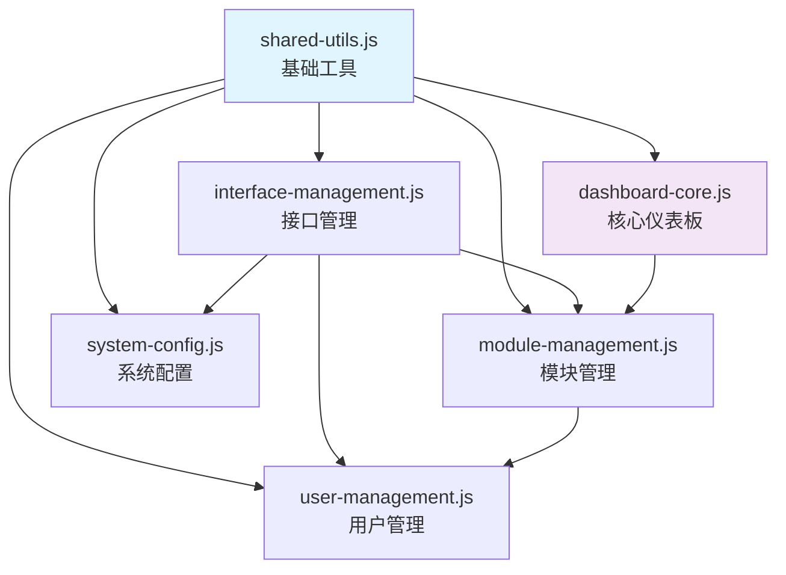

# EITEC VPN - JavaScript 模块化架构说明

## 📋 项目背景

原始的 `dashboard.js` 文件包含 **2,277行代码 (104.5KB)**，严重影响了代码的可维护性和开发效率。为了提高代码质量和开发体验，我们将其重构为模块化架构。

## 🗂️ 模块化文件结构

```
web/server/assets/js/
├── shared-utils.js           # 4.8KB  - 共享工具函数
├── module-management.js      # 12.3KB - 模块管理功能
├── dashboard-core.js         # 15.9KB - 核心仪表板功能
├── user-management.js        # 18.0KB - 用户管理功能
├── system-config.js          # 25.5KB - 系统配置管理
├── interface-management.js   # 30.0KB - 接口管理功能
├── ─────────────────────────────────────────────
├── dashboard-legacy.js.bak   # 104.5KB - 原始文件备份
└── dashboard-original-backup.js # 104.5KB - 安全备份
```

## 📊 拆分效果统计

| 指标 | 原始架构 | 模块化架构 | 改进效果 |
|------|----------|------------|----------|
| **文件数量** | 1个巨大文件 | 6个功能模块 | ✅ 提高可维护性 |
| **单文件最大大小** | 104.5KB | 30.0KB | ✅ 减少70% |
| **平均文件大小** | 104.5KB | 17.8KB | ✅ 减少83% |
| **功能分离度** | 全部混合 | 高度模块化 | ✅ 清晰的职责分工 |
| **并行开发支持** | ❌ 容易冲突 | ✅ 支持多人协作 |

## 🔗 模块依赖关系



## 📦 各模块功能详解

### 🔧 shared-utils.js (4.8KB)
- **职责**: 提供所有模块共用的工具函数
- **核心功能**:
  - 数据格式化 (`formatBytes`, `formatDateTime`)
  - 网络验证 (`validateNetworkFormat`)
  - API请求封装 (`apiRequest`)
  - 权限检查 (`checkInterfaceEditPermission`)
  - 模态框管理 (`safeCloseModal`)
- **依赖**: 无，必须最先加载
- **被依赖**: 所有其他模块

### 🏗️ interface-management.js (30.0KB)
- **职责**: WireGuard网络接口的完整生命周期管理
- **核心功能**:
  - 接口创建、启动、停止、删除
  - 配置预览和模板应用
  - 接口状态监控和管理界面
- **依赖**: shared-utils.js, bootstrap
- **为谁服务**: module-management.js, user-management.js

### 🔗 module-management.js (12.3KB)
- **职责**: WireGuard模块的管理和配置
- **核心功能**:
  - 模块创建和删除
  - 模块配置下载
  - 模块状态管理和显示
- **依赖**: shared-utils.js, interface-management.js
- **业务关联**: user-management.js

### 👥 user-management.js (18.0KB)
- **职责**: VPN用户的权限和配置管理
- **核心功能**:
  - 用户创建和删除
  - 用户配置文件生成
  - 用户状态控制 (激活/停用)
- **依赖**: shared-utils.js, module-management.js
- **业务逻辑**: 用户必须属于某个模块

### ⚙️ system-config.js (25.5KB)
- **职责**: 系统级配置和高级管理功能
- **核心功能**:
  - 系统状态概览
  - 配置导出和备份
  - 系统日志查看
  - WireGuard服务管理
- **依赖**: shared-utils.js, interface-management.js
- **级别**: 系统管理员功能

### 📊 dashboard-core.js (15.9KB)
- **职责**: 仪表板的核心显示和数据协调
- **核心功能**:
  - ECharts图表管理
  - 数据加载和刷新
  - 统计信息显示
  - 系统监控面板
- **依赖**: shared-utils.js, module-management.js, echarts
- **角色**: 数据展示协调者

## 🚀 加载顺序

HTML中的script标签按以下顺序加载：

```html
<!-- 1. 共享工具函数 (必须最先加载) -->
<script src="/assets/js/shared-utils.js"></script>

<!-- 2. 功能模块 (可以并行加载) -->
<script src="/assets/js/module-management.js"></script>
<script src="/assets/js/interface-management.js"></script>
<script src="/assets/js/user-management.js"></script>
<script src="/assets/js/system-config.js"></script>

<!-- 3. 核心仪表板 (最后加载) -->
<script src="/assets/js/dashboard-core.js"></script>
```

## ✅ 模块化优势

### 🔧 开发体验改进
- **代码分离**: 每个文件职责单一，易于理解和修改
- **并行开发**: 多人可以同时开发不同功能模块
- **调试便利**: 问题定位更加精确，减少调试时间
- **代码复用**: 共享工具函数避免重复代码

### 📈 性能优化
- **按需加载**: 理论上可以实现功能模块的按需加载
- **缓存友好**: 小文件更容易被浏览器缓存
- **并行下载**: 多个小文件可以并行下载

### 🛠️ 维护性提升
- **影响范围控制**: 修改某个功能不会影响其他模块
- **测试隔离**: 可以针对单个模块进行单元测试
- **版本管理**: Git冲突减少，合并更加顺畅

## 🔄 迁移说明

### 原始文件处理
- `dashboard.js` → `dashboard-legacy.js.bak` (已重命名)
- `dashboard-original-backup.js` (安全备份)

### 回滚方案
如需回滚到原始架构：
```bash
# 1. 还原原始文件
mv dashboard-legacy.js.bak dashboard.js

# 2. 更新HTML引用
# 将index.html中的模块化script标签替换为单一的dashboard.js引用

# 3. 删除模块化文件 (可选)
rm shared-utils.js module-management.js interface-management.js
rm user-management.js system-config.js dashboard-core.js
```

## 📋 开发指南

### 添加新功能
1. **确定归属模块**: 新功能应该属于哪个现有模块？
2. **考虑依赖关系**: 是否需要新的共享工具函数？
3. **更新文档**: 修改对应模块的功能说明注释
4. **测试兼容性**: 确保不破坏其他模块的功能

### 修改现有功能
1. **定位目标模块**: 使用文件头的功能说明快速定位
2. **检查依赖影响**: 修改共享函数时要考虑影响范围
3. **保持接口一致**: 不要随意修改全局导出的函数签名

## 📝 总结

模块化重构将原始的 **104.5KB 单体文件** 拆分为 **6个功能清晰的模块**，每个模块平均大小仅为 **17.8KB**。这不仅大幅提升了代码的可维护性和开发效率，还为未来的功能扩展和团队协作奠定了良好的基础。

**开发效率提升预期**: 🚀🚀🚀🚀🚀 (★★★★★) 